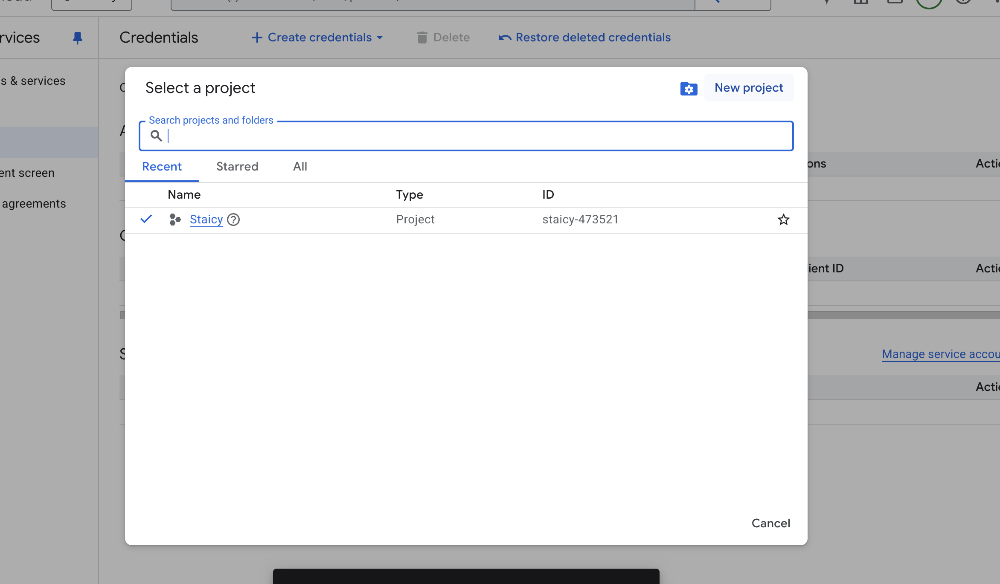
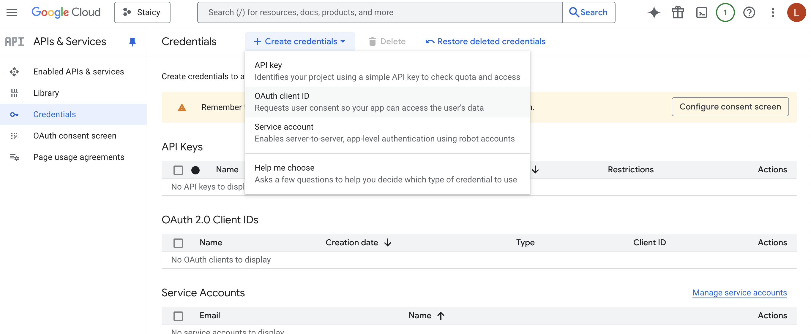
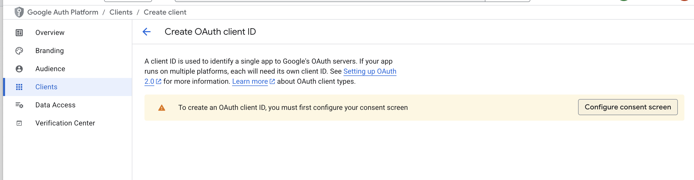
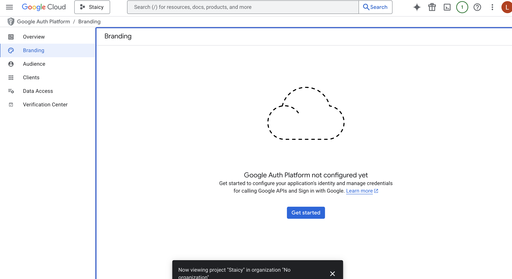
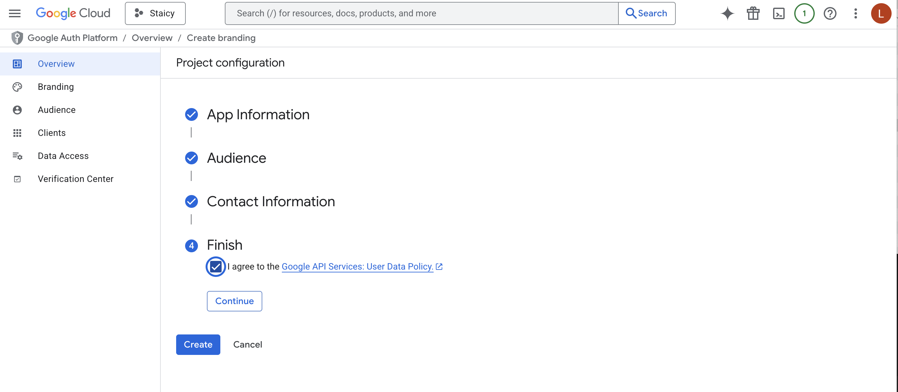
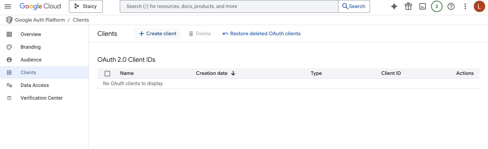
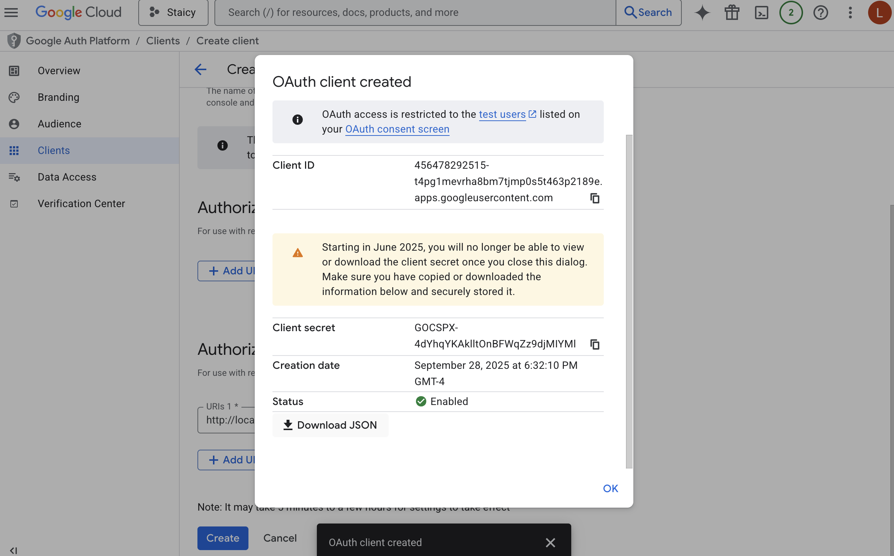
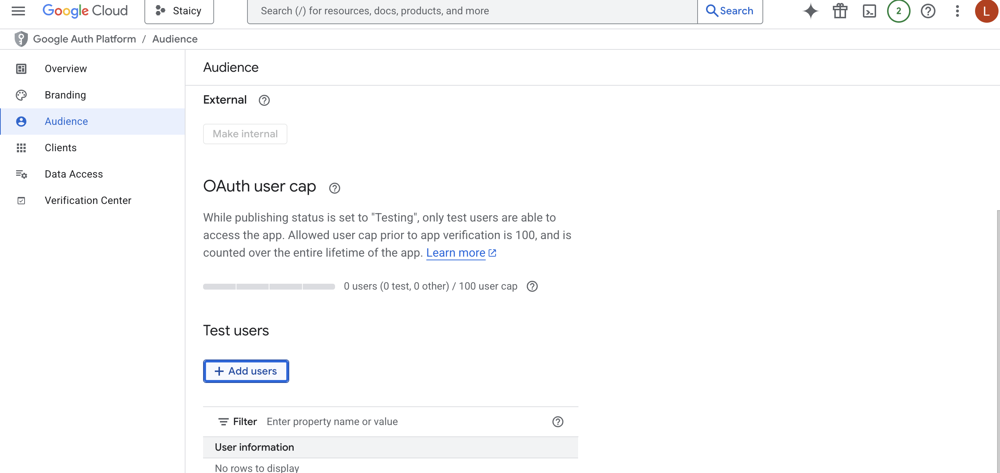
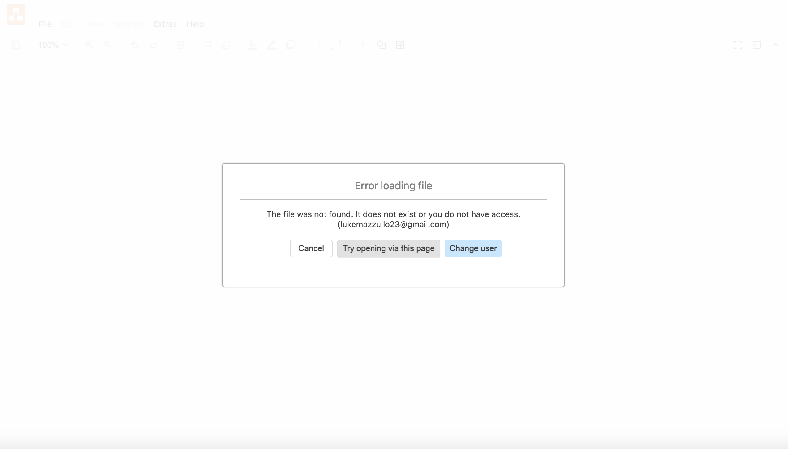

# Staicy - Intelligent Documentation System

An AI-powered documentation platform that helps teams capture knowledge, generate diagrams, and maintain living documents with real-time collaboration features.

## 🚀 Features

### Core Features
- **AI-Powered Documentation**: Generate documentation (flowcharts, uml, eerd) from code, natural language, and existing content
- **Real-time Collaboration**: Live editing with file upload, initial prompt, and back and forth chat with LLM.
- **Intelligent Diagrams**: Auto-generate flowcharts, sequence diagrams, and architecture diagrams
- **Rich Text Editor**: Advanced editing with AI suggestions and auto-updating xml files
- **Preview of Drawing**: Real preview of Draw.io drawing shown right in the chat web page.

### AI Capabilities
- **Code to Documentation**: Automatically generate docs from code repositories
- **Natural Language Processing**: Convert descriptions to structured documentation
- **Smart Suggestions**: AI-powered improvements and content recommendations
- **Diagram Generation**: Create visual diagrams from text descriptions
- **Content Optimization**: Ability to collaborate and discuss changes to diagrams with LLM

## Directions for how to Configure and Use
1) Clone the repository `git clone https://github.com/aeimo/staicy.git`
2) Install dependencies
```
cd staicy
# Install root dependencies
npm install
npm install --save-dev @types/node

# Install backend dependencies
cd backend
npm install

# Install frontend dependencies:
cd ../frontend
npm install
```
3) `cd ../backend/utils` and create gemini.json like below (staicy/backend/utils/gemini.json)
```
{
  "apiKey" : "YOUR API KEY HERE"
}
```
4) Setup Google Oauth
a) Go to this link: https://console.cloud.google.com/apis/credentials
Open the project picker and create a new project called Staicy


b) Create new credentials: Click Create Credentials → OAuth client ID.

c) It might prompt you to configure consent screen. Click Configure Consent Screen and then Click Get Started


d) Type Staicy for App name and enter your email address for User support email. Then click External for audience. Enter your email address again where it says Contact Information. Then click I agree, continue, and create.

6) Finish setting up your Oauth Client Id. Click Clients, then Create Client

a) Enter Web Application for Application Type and then WebClient1 for Name. Under Authorized redirect URIs. Click Add URI and enter http://localhost. Click create
7) From the pop-up click Download JSON.

8) Rename this json to credentials.json and save it in backend/src/. Delete the `{"web":` at the start of the file if it is there and the extra closing `}` if it is there.
9) Go back to the pop-up and click ok. Then click Audience and then click Add users under Test users. Enter your same email address again. Hit enter and then click save.

9) From the backend directory, Run `npm install googleapis` then `npx ts-node src/getDriveToken.ts`. This will produce some terminal output.
10) In the terminal log, click the link that is given, then login with your same gmail address again. Then click continue and continue. You will reach a site that can't be reached. From that url which will look like: `http://localhost/?code=YOURCODEHERE&scope=https://www.googleapis.com/auth/drive.file`, copy the code written after code  between the `=` and the `&` where it says YOURCODEHERE in the example shown. That is your code. Enter that value in the command line after it says `Enter authorization code:` and hit enter. This will create token.json in backend/src.
11) Run `npx ts-node src/server.ts`. You will get a long error message. Near the end of the message it will say. `message: 'Google Drive API has not been used in project 456478292515 before or it is disabled. Enable it by visiting https://console.developers.google.com/apis/api/drive.googleapis.com/overview?project=456478292515 then retry. If you enabled this API recently, wait a few minutes for the action to propagate to our systems and retry.'` Click the link in that part of the error message. Then click enable.
12) run `npx ts-node src/server.ts` again. In the console output like the one shown below, click the link next to open in draw.io. Then log in with your same gmail if needed, and after it loads, click Try Opening in this Page.
```
Server running on http://localhost:5001
✅ Created new diagram with ID: 1ldI60cGw-PEy_kAvBpR_lth2ru0VUjEB
📄 Diagram updated on Drive (ID: 1ldI60cGw-PEy_kAvBpR_lth2ru0VUjEB)
🔗 Open in draw.io: https://app.diagrams.net/?mode=google&fileId=1ldI60cGw-PEy_kAvBpR_lth2ru0VUjEB
```


13) Click open with draw.io. Then click File -> Embed -> IFrame. Leave the default settings and click create. Copy the link within the iframe where it says src="LongLinkHere". Then close that pop-up window.

14) In staicy/frontend/src/pages, add drawio.json formatted as shown below:
```
{
  "url" : "THE_LINK_YOU_COPIED_IN_STEP_13"
}
```

15) Now the repository links a drawing directly to your google drive.

## How to Open App
After the above setup, you are ready to use the feature.

### Option 1 (Preferred)
Open two terminals. In one cd to the backend director. In the other cd to the frontend directoy.
From the backend directory, run
`npx ts-node src/server.ts`
From the frontend directory, run
`npm run dev`
In a browser, search localhost:3000

### Option 2
From the staicy root directory run `npm run dev`
In a browser, search localhost:3000

## 🏗️ Architecture

### Backend (Node.js/Express + TypeScript)
```
backend/
├── src/              # Setup code
├── routes/           # Frontend to Backend communication
├── models/           # Database models
├── node_modules/     # modules
└── utils/            # Utility functions
```

### Frontend (React + TypeScript)
```
src/
├── components/        # Reusable UI components
├── pages/             # Route components
├── contexts/          # React contexts (Auth, Collaboration)
├── services/          # API client services
├── types/             # TypeScript type definitions
```

## 🛠️ Tech Stack

### Backend
- **Runtime**: Node.js 18+
- **Framework**: Express.js with TypeScript
- **Database**: PostgreSQL with Prisma ORM
- **Authentication**: Google OAuth
- **AI Services**: Gemini 2.5-flash
- **Caching**: Redis for session management

### Frontend
- **Framework**: React 18 with TypeScript
- **Styling**: Tailwind CSS with custom components
- **State Management**: React Context + Zustand
- **Routing**: React Router v6
- **Rich Text**: TipTap editor with collaboration
- **Diagrams**: Mermaid.js integration
- **Build Tool**: Vite

### AI & ML
- **Gemini API**: Document generation and improvement
- **OpenAI API**: Alternative AI provider
- **Mermaid.js**: Diagram generation and rendering
- **PlantUML**: UML diagram support
- **Natural Language Processing**: Content analysis and suggestions

## 📚 API Documentation

### Authentication Endpoints
- `POST /api/auth/register` - User registration
- `POST /api/auth/login` - User login
- `POST /api/auth/logout` - User logout
- `GET /api/auth/me` - Get current user
- `PUT /api/auth/profile` - Update user profile

### Document Endpoints
- `GET /api/documents` - List documents with filtering
- `POST /api/documents` - Create new document
- `GET /api/documents/:id` - Get document details
- `PUT /api/documents/:id` - Update document
- `DELETE /api/documents/:id` - Delete document
- `POST /api/documents/:id/ai/suggestions` - Get AI suggestions
- `POST /api/documents/generate-from-code` - Generate from code

### Diagram Endpoints
- `GET /api/diagrams` - List diagrams
- `POST /api/diagrams` - Create diagram
- `POST /api/diagrams/generate` - AI generate diagram
- `POST /api/diagrams/text-to-diagram` - Convert text to diagram
- `POST /api/diagrams/diagram-to-text` - Extract text from diagram

### Integration Endpoints
- `GET /api/integrations` - List integrations
- `POST /api/integrations` - Create integration
- `POST /api/integrations/github/sync` - Sync with GitHub
- `POST /api/integrations/slack/webhook` - Slack webhook
- `POST /api/integrations/confluence/sync` - Confluence sync


## 🚀 Deployment

### Docker Deployment
```bash
# Build and run with Docker Compose
docker-compose up -d

# Or build individual services
docker build -t staicy-backend ./backend
docker build -t staicy-frontend ./frontend
```

### Production Deployment
```bash
# Build for production
npm run build

# Start production server
npm start
```

### Environment-Specific Configs
- **Development**: Local development with hot reload
- **Staging**: Pre-production testing environment
- **Production**: Live production environment

## 🤝 Contributing

1. Fork the repository
2. Create a feature branch (`git checkout -b feature/amazing-feature`)
3. Commit your changes (`git commit -m 'Add amazing feature'`)
4. Push to the branch (`git push origin feature/amazing-feature`)
5. Open a Pull Request

### Development Guidelines
- Follow TypeScript best practices
- Write tests for new features
- Update documentation
- Follow the existing code style
- Use conventional commits

## 🚀 Quick Start

### Prerequisites
- Node.js 18+ and npm
- Gemini API Key

## 📄 License

This project is licensed under the MIT License - see the [LICENSE](LICENSE) file for details.

## 🙏 Acknowledgments

- Gemini for Gemini-2.5-flash
- Mermaid.js for diagram generation
- Draw.io for hosting diagrams with xmls
- Prisma for database management

## 📞 Support

- **Documentation**: [docs.staicy.com](https://docs.staicy.com)
- **Issues**: [GitHub Issues](https://github.com/your-org/staicy/issues)
- **Discussions**: [GitHub Discussions](https://github.com/your-org/staicy/discussions)
- **Email**: support@staicy.com

---

Built with ❤️ by the Staicy Team
